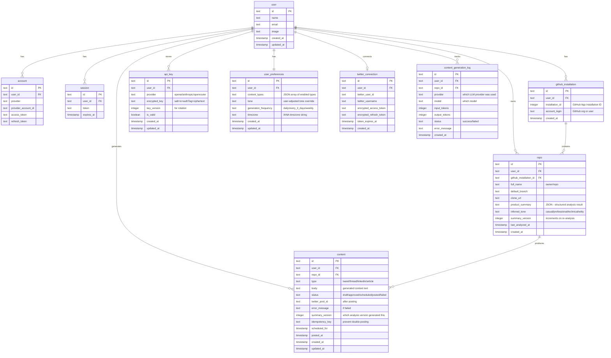

# feat: Building in Public Agent Platform

## Overview

An open-source platform for solo builders who build in public. It integrates into their codebase via a GitHub App, analyzes the full repo, and auto-generates marketing content (tweets, threads, articles) on a user-configured schedule. Users bring their own LLM API keys (BYOK), and the system posts to Twitter/X on their behalf.

The platform is a Turborepo monorepo with three services: a Next.js 16 web app, an Inngest worker service, and a Mastra AI agent service. PostgreSQL + Drizzle for persistence, Better Auth for GitHub social login, shadcn/ui + Tailwind for the frontend.

(see brainstorm: `docs/brainstorms/2026-04-13-building-in-public-agent-brainstorm.md`)

## Problem Statement

Solo builders spend hours each week crafting marketing content to stay visible. They know their product best — it's in the code — but translating technical work into engaging social content is a different skill. This platform automates that translation: read the code, understand the product, generate content that sounds like the builder.

## Proposed Solution

A three-service architecture where:
- **apps/web** (Next.js 16) handles auth, onboarding, dashboard, content calendar, and API routes
- **apps/worker** (Node.js + Inngest) handles scheduling, cron triggers, Twitter posting, and background tasks
- **apps/agent** (Mastra) handles repo analysis, content generation, and LLM provider routing

Shared packages for database schema (`@repo/db`), types (`@repo/types`), and UI components (`@repo/ui`).

## Technical Approach

### Architecture

```
┌─────────────────────────────────────────────────────────┐
│                    apps/web (Next.js 16)                 │
│  ┌──────────┐  ┌──────────┐  ┌────────────────────────┐ │
│  │  Auth     │  │ Dashboard│  │ API Routes             │ │
│  │ (Better   │  │ (shadcn/ │  │ /api/auth/[...all]     │ │
│  │  Auth +   │  │  ui +    │  │ /api/inngest           │ │
│  │  GitHub)  │  │  calendar│  │ /api/github/webhook     │ │
│  └──────────┘  └──────────┘  │ /api/twitter/callback   │ │
│                               └────────────────────────┘ │
└─────────────────────┬───────────────────────────────────┘
                      │ Events (Inngest)
┌─────────────────────▼───────────────────────────────────┐
│               apps/worker (Node.js + Inngest)            │
│  ┌──────────────────┐  ┌───────────────────────────────┐ │
│  │ Cron: content     │  │ Event handlers:               │ │
│  │ generation per    │  │ - repo.push (webhook)         │ │
│  │ user schedule     │  │ - content.publish (scheduled) │ │
│  └────────┬─────────┘  │ - user.onboarded (setup)      │ │
│           │             └───────────────────────────────┘ │
└───────────┼─────────────────────────────────────────────┘
            │ HTTP calls
┌───────────▼─────────────────────────────────────────────┐
│               apps/agent (Mastra)                        │
│  ┌──────────────────┐  ┌───────────────────────────────┐ │
│  │ Repo Analysis     │  │ Content Generation            │ │
│  │ Agent             │  │ Agent                         │ │
│  │ (clone, parse,    │  │ (product summary →            │ │
│  │  summarize)       │  │  tweets/threads/articles)     │ │
│  └──────────────────┘  └───────────────────────────────┘ │
└─────────────────────────────────────────────────────────┘
            │
┌───────────▼─────────────────────────────────────────────┐
│               packages/db (Drizzle + PostgreSQL)         │
│  Schema: users, accounts, sessions, repos,               │
│  api_keys, content, content_schedules, preferences       │
└─────────────────────────────────────────────────────────┘
```

### Data Model (ERD)



### Content State Machine

```
  [generate]        [user action]       [cron trigger]       [API call]
      │                  │                    │                   │
      ▼                  ▼                    ▼                   ▼
   ┌──────┐         ┌──────────┐        ┌───────────┐       ┌────────┐
   │ draft │────────▶│ approved │───────▶│ scheduled │──────▶│ posted │
   └──────┘         └──────────┘        └───────────┘       └────────┘
      │                  │                    │                   │
      │                  │                    │                   │
      ▼                  ▼                    ▼                   ▼
   ┌──────────┐     ┌──────────┐        ┌──────────┐       (terminal)
   │ discarded│     │ discarded│        │  failed  │───────▶ retry
   └──────────┘     └──────────┘        └──────────┘     (back to scheduled)
```

Valid transitions:
- `draft` → `approved` (user approves) | `discarded` (user rejects)
- `approved` → `scheduled` (user sets publish time) | `discarded`
- `scheduled` → `posted` (successful publish) | `failed` (API error)
- `failed` → `scheduled` (retry, max 3 attempts)

### Implementation Phases

---

#### Phase 1: Foundation

Sets up the monorepo structure, database, auth, and shared packages. Everything else builds on this.

**1.1 Monorepo Restructuring**

- Remove `apps/docs` (unused starter)
- Configure `apps/web` as the main Next.js 16 app
- Create `apps/worker` — Node.js service with Express, Inngest SDK
- Create `apps/agent` — Mastra service
- Create `packages/db` — Drizzle schema, client, migrations
- Create `packages/types` — Shared TypeScript types (content states, API key providers, etc.)
- Add `node-library.json` to `@repo/typescript-config` for non-Next packages
- Update root `turbo.json` — add `dist/**` outputs for worker/agent builds

Files to create/modify:

```
packages/typescript-config/node-library.json    # new — extends base.json, CommonJS/NodeNext
packages/db/package.json                        # new — @repo/db
packages/db/src/schema.ts                       # new — all table definitions
packages/db/src/client.ts                       # new — Drizzle client + pg Pool
packages/db/src/index.ts                        # new — barrel export
packages/db/drizzle.config.ts                   # new — Drizzle Kit config
packages/db/src/env.ts                          # new — Zod env validation for DATABASE_URL
packages/types/package.json                     # new — @repo/types
packages/types/src/index.ts                     # new — shared enums, types
apps/worker/package.json                        # new — inngest, express
apps/worker/src/index.ts                        # new — Express server + Inngest serve
apps/worker/src/env.ts                          # new — Zod env validation
apps/agent/package.json                         # new — @mastra/core
apps/agent/src/index.ts                         # new — Mastra instance + agents
apps/agent/src/env.ts                           # new — Zod env validation
turbo.json                                      # modify — add dist outputs
```

**1.2 Database Schema + Migrations**

- Define all tables in `packages/db/src/schema.ts` (see ERD above)
- Better Auth tables: run `npx @better-auth/cli generate` to get the exact schema, then integrate into Drizzle schema
- Run `drizzle-kit generate` from `packages/db` to create initial migration
- Validate migration applies cleanly to a fresh Postgres instance

**1.3 Authentication (Better Auth + GitHub)**

- Install Better Auth in `apps/web`
- Configure auth server in `apps/web/lib/auth.ts` with Drizzle adapter and GitHub social provider
- Mount catch-all route at `apps/web/app/api/auth/[...all]/route.ts` using `toNextJsHandler`
- Create auth client in `apps/web/lib/auth-client.ts` using `createAuthClient()`
- Add session middleware for protected routes
- Zod validation for auth env vars: `GITHUB_CLIENT_ID`, `GITHUB_CLIENT_SECRET`, `BETTER_AUTH_SECRET`, `BETTER_AUTH_URL`

Files:

```
apps/web/lib/auth.ts                            # new — Better Auth server config
apps/web/lib/auth-client.ts                     # new — client-side auth
apps/web/app/api/auth/[...all]/route.ts         # new — auth API route
apps/web/middleware.ts                           # new — session protection
apps/web/src/env.ts                             # new — Zod env validation
```

**1.4 shadcn/ui Setup**

- Run `npx shadcn@latest init --monorepo` from repo root
- Configure `packages/ui/components.json` with proper aliases
- Install base components: Button, Card, Input, Toggle, Calendar, Dialog, DropdownMenu, Badge, Tabs
- Verify cross-app imports work from `apps/web`

---

#### Phase 2: GitHub App + Repository Analysis

Connects the user's repo and runs the first analysis.

**2.1 GitHub App Configuration**

- Create a GitHub App (documented in README for self-hosters)
- Required permissions: `Contents: Read` (repository level)
- Subscribe to webhook events: `push`, `installation`
- Configure webhook URL: `{APP_URL}/api/github/webhook`
- Env vars: `GITHUB_APP_ID`, `GITHUB_APP_PRIVATE_KEY`, `GITHUB_WEBHOOK_SECRET`

**2.2 GitHub App Installation Flow**

- Dashboard page to trigger GitHub App installation (`https://github.com/apps/{APP_SLUG}/installations/new`)
- Callback handler to store `github_installation` and `repo` records
- Handle `installation.deleted` webhook — mark repos as disconnected, halt scheduled generation
- UI state for connected/disconnected repos

Files:

```
apps/web/app/api/github/webhook/route.ts        # new — webhook handler with signature verification
apps/web/app/api/github/callback/route.ts        # new — installation callback
apps/web/app/(dashboard)/repos/page.tsx          # new — repo management page
apps/web/lib/github.ts                           # new — Octokit setup, installation token management
```

**2.3 Repository Analysis (Mastra Agent)**

- Define `repoAnalysisAgent` in `apps/agent` using Mastra
- Workflow: clone repo → parse file structure → read README → analyze package configs → identify tech stack → summarize product purpose
- Store structured `product_summary` JSON in the `repo` table
- Infer tone from README/docs writing style, store as `inferred_tone`
- Implement repo size limit check (fail gracefully for repos > 500MB)
- Cleanup: delete cloned repo after analysis (never persist on disk longer than needed)
- Security: skip `.env` files and known secret patterns during analysis

Files:

```
apps/agent/src/agents/repo-analysis.ts           # new — Mastra agent definition
apps/agent/src/workflows/analyze-repo.ts         # new — clone + analyze workflow
apps/agent/src/tools/clone-repo.ts               # new — git clone tool
apps/agent/src/tools/parse-structure.ts          # new — file tree parser
apps/agent/src/tools/read-files.ts               # new — selective file reader
```

**2.4 Webhook-Triggered Re-analysis**

- Handle `push` events on default branch in the webhook handler
- Send `repo.push` event to Inngest
- Inngest function triggers re-analysis via Mastra agent
- Increment `summary_version` on the repo record
- Flag existing `draft` content as potentially stale (via `summary_version` comparison)

---

#### Phase 3: BYOK + Onboarding

User provides their keys and configures preferences.

**3.1 BYOK Key Encryption Module**

- Implement in `packages/db/src/crypto.ts` (shared across services)
- `encryptApiKey(plaintext, userId)` → encrypted blob (salt + iv + authTag + ciphertext, base64)
- `decryptApiKey(encryptedBlob, userId)` → plaintext
- Use `crypto.hkdfSync('sha256', APP_SECRET, randomSalt, 'api-key-encryption', 32)` for per-user key derivation
- Generate random 16-byte salt per encryption operation (stored with ciphertext)
- Generate random 12-byte IV per encryption (stored with ciphertext)
- AES-256-GCM for authenticated encryption
- Key validation: after encryption, attempt a test API call to verify the key works before saving
- Env var: `ENCRYPTION_SECRET` (32+ byte secret, Zod validated)

Files:

```
packages/db/src/crypto.ts                        # new — encrypt/decrypt functions
packages/db/src/crypto.test.ts                   # new — unit tests
```

**3.2 BYOK Management UI**

- Settings page to add/update/remove API keys
- Provider selection (OpenAI, Anthropic, OpenRouter) with key input
- Key validation on save (test call to provider)
- Display masked key (last 4 chars) and validation status
- Support for key rotation — re-encrypt with new salt

Files:

```
apps/web/app/(dashboard)/settings/keys/page.tsx  # new — API key management
apps/web/app/api/keys/route.ts                   # new — CRUD API for keys
apps/web/app/api/keys/validate/route.ts          # new — key validation endpoint
```

**3.3 Onboarding Flow**

- Multi-step onboarding (resumable — track progress in `user_preferences`)
- Step 1: Product questions (name, one-line description, target audience) — free text
- Step 2: Content type toggles (Tweets, Thread ideas, LinkedIn posts, Reddit posts, Instagram captions, TikTok scripts)
- Step 3: Generation frequency selector (daily / every 3 days / weekly)
- Step 4: Timezone picker (auto-detect from browser, allow override)
- Step 5: Tone display (show agent-inferred tone from repo analysis, allow adjustment via slider/dropdown: casual ↔ professional, technical ↔ accessible, witty ↔ straightforward)
- Step 6: BYOK key setup (inline from 3.2)
- Mark onboarding complete — fire `user.onboarded` Inngest event to set up cron schedule

Resumability: if user drops off at any step, they return to where they left off. Dashboard shows "Setup incomplete" banner with a link to continue.

Files:

```
apps/web/app/(onboarding)/layout.tsx             # new — onboarding layout
apps/web/app/(onboarding)/step/[step]/page.tsx   # new — dynamic step pages
apps/web/lib/onboarding.ts                       # new — step definitions + validation
```

---

#### Phase 4: Content Generation + Dashboard

The core value — generating and managing content.

**4.1 Content Generation Agent (Mastra)**

- Define `contentGenerationAgent` in `apps/agent`
- Input: product summary, enabled content types, tone preferences, generation log (to avoid repetition)
- Output: array of content items (type + body + suggested_scheduled_time)
- Per content type, use specialized prompts (tweet = 280 chars, thread = multi-tweet, article = 500-1000 words)
- Deduplicate: pass last 20 generated content items as negative examples
- Track token usage in `content_generation_log` table

Files:

```
apps/agent/src/agents/content-generation.ts      # new — Mastra agent
apps/agent/src/workflows/generate-content.ts     # new — generation workflow
apps/agent/src/prompts/tweet.ts                  # new — tweet-specific prompt
apps/agent/src/prompts/thread.ts                 # new — thread prompt
apps/agent/src/prompts/article.ts                # new — article prompt
```

**4.2 Inngest Scheduled Generation**

- `content.generate` function — triggered by per-user cron
- On `user.onboarded` event: register a dynamic cron schedule for the user
- Cron reads user preferences, fetches product summary, calls Mastra agent
- Store generated content as `draft` status
- Handle failures: if BYOK key is invalid, mark key as `is_valid: false`, notify user (store notification), skip generation until key is fixed
- Idempotency: use `{userId}-{date}-{frequency}` as deduplication key

Files:

```
apps/worker/src/functions/generate-content.ts    # new — Inngest function
apps/worker/src/functions/setup-schedule.ts      # new — schedule registration on onboarding
```

**4.3 Content Dashboard**

- Main dashboard page showing content in a list/card view
- Filter by: status (draft/approved/scheduled/posted/failed), type, date
- Content card: preview text, type badge, status badge, actions (approve, edit, schedule, discard)
- Inline editing with character count (280 for tweets)
- Bulk approve/schedule actions
- "Generate Now" button for on-demand generation

Files:

```
apps/web/app/(dashboard)/page.tsx                # new — main dashboard
apps/web/app/(dashboard)/content/[id]/page.tsx   # new — content detail/edit
apps/web/components/content-card.tsx             # new — content card component
apps/web/components/content-filters.tsx          # new — filter controls
```

**4.4 Content Calendar**

- Calendar view showing scheduled content by date/time
- Drag-and-drop to reschedule
- Visual indicators for posted (green), scheduled (blue), failed (red)
- Week/month toggle
- Timezone-aware display (user's configured timezone)

Files:

```
apps/web/app/(dashboard)/calendar/page.tsx       # new — calendar page
apps/web/components/content-calendar.tsx         # new — calendar component
```

---

#### Phase 5: Twitter/X Integration

Posts content to Twitter on the user's behalf.

**5.1 Twitter OAuth 2.0 Connection**

- OAuth 2.0 PKCE flow for user authorization
- Store encrypted access token + refresh token in `twitter_connection` table (using the same BYOK encryption module)
- Token refresh: proactively refresh when `token_expires_at` is within 5 minutes
- Handle token revocation: if refresh fails with invalid_grant, mark connection as disconnected, notify user
- Settings page to connect/disconnect Twitter account

Files:

```
apps/web/app/api/twitter/auth/route.ts           # new — initiate OAuth flow
apps/web/app/api/twitter/callback/route.ts       # new — OAuth callback
apps/web/lib/twitter.ts                          # new — Twitter API client, token refresh
apps/web/app/(dashboard)/settings/twitter/page.tsx # new — Twitter connection UI
```

**5.2 Scheduled Posting (Inngest)**

- `content.publish` function — triggered when `scheduled_for` time arrives
- Decrypt Twitter OAuth token at runtime
- Post via Twitter API v2 (`POST /2/tweets`)
- On success: update content status to `posted`, store `twitter_post_id`
- On failure: update status to `failed`, store `error_message`, retry up to 3 times with exponential backoff
- Rate limit awareness: if 429 response, use `step.sleep()` for the `retry-after` duration
- Idempotency: check `idempotency_key` before posting to prevent double-posts
- Optimistic locking: check content status is still `scheduled` before posting (guard against concurrent edits)

Files:

```
apps/worker/src/functions/publish-content.ts     # new — Inngest function
apps/worker/src/lib/twitter-client.ts            # new — Twitter API wrapper
```

**5.3 Rate Limit Management**

- Twitter Free tier: 1,500 tweets/month, 200 per 15-min window (app-level)
- Track app-level tweet count in a Redis counter or DB table
- Queue posts with backoff when approaching limits
- Notify users if their post was delayed due to rate limiting

---

#### Phase 6: Polish + Security Hardening

**6.1 Error Handling + Notifications**

- In-app notification system (DB-backed) for:
  - BYOK key validation failures
  - Twitter connection issues
  - Content generation failures
  - Repo disconnection
- Dashboard notification bell with unread count
- Email notifications (optional, future — not in v1)

**6.2 Security Hardening**

- GitHub webhook signature verification (`X-Hub-Signature-256` with `crypto.timingSafeEqual`)
- CSRF protection on all mutation endpoints
- Rate limiting on API routes (especially key validation and content generation)
- Cloned repo cleanup: delete immediately after analysis, never persist
- Skip `.env`, `.env.*`, `*.pem`, `*.key` files during repo analysis
- Document self-hosted security model in README

**6.3 Account Management**

- Account deletion flow: delete user + all related data (keys, content, connections, installations)
- Revoke GitHub App installation via API on account deletion
- Revoke Twitter OAuth token on account deletion or disconnect
- Data export (JSON download of all user data)

**6.4 Edge Case Handling**

- Empty/trivial repos: detect and show "Your repo doesn't have enough content for analysis yet" message
- Partial onboarding: resumable state machine, dashboard banner for incomplete setup
- Stale content after re-analysis: flag drafts generated from older `summary_version`
- Concurrent edit guard: optimistic locking on content status transitions
- Multi-repo: onboarding asks "which repo is your primary product?" — content is generated per-repo

## System-Wide Impact

### Interaction Graph

1. User signs in → Better Auth creates `user` + `account` + `session` records
2. GitHub App installed → webhook fires → `github_installation` + `repo` created → `user.repo.added` Inngest event → Mastra repo analysis → `repo.product_summary` updated
3. Onboarding completed → `user.onboarded` Inngest event → Inngest registers per-user cron schedule
4. Cron fires → `content.generate` Inngest function → decrypt BYOK key → call Mastra content agent → store `content` records as `draft`
5. User approves + schedules content → `content.status` = `scheduled`
6. Schedule time arrives → `content.publish` Inngest function → decrypt Twitter token → POST to Twitter API → `content.status` = `posted`
7. Push to repo → GitHub webhook → `repo.push` Inngest event → Mastra re-analysis → `summary_version` incremented

### Error Propagation

- **LLM failure** (Mastra agent) → Inngest retries (3x with backoff) → if permanent (invalid key), mark `api_key.is_valid = false` + create notification → halt generation until key fixed
- **Twitter API failure** → Inngest retries (3x) → if auth failure, mark `twitter_connection` as disconnected + notify → content stays `failed`
- **GitHub webhook failure** → Inngest retries → if repo access revoked, mark repo as disconnected + notify
- **Database failure** → all services fail fast, Inngest retries handle transient DB errors

### State Lifecycle Risks

- **Partial onboarding**: User could have `user_preferences` partially filled. Mitigated by step tracking and validation before completing onboarding.
- **Content double-posting**: Mitigated by `idempotency_key` on content records and optimistic status check before posting.
- **Stale encryption keys**: If `ENCRYPTION_SECRET` is rotated, all encrypted data becomes unreadable. Mitigated by key version tracking and lazy re-encryption.
- **Orphaned cron schedules**: If a user deletes their account, their Inngest cron must be cancelled. Handle in account deletion flow.

### API Surface Parity

All user-facing actions should be available via both:
- Dashboard UI (Next.js pages)
- API routes (for future CLI tool, mobile app, or third-party integrations)

### Integration Test Scenarios

1. **Full lifecycle**: Sign up → install app → onboard → generate content → approve → schedule → post → verify tweet exists
2. **BYOK rotation**: Add key → generate content → rotate key → generate again → verify old content still accessible
3. **Webhook re-analysis**: Push to repo → verify re-analysis triggers → verify new content reflects updated summary
4. **Token expiry**: Simulate expired Twitter token → verify proactive refresh → verify post succeeds
5. **Failure recovery**: Simulate LLM provider down → verify retries → verify notification created → fix key → verify generation resumes

## Acceptance Criteria

### Functional Requirements

- [ ] User can sign up with GitHub and land on the dashboard
- [ ] User can install the GitHub App and see connected repos
- [ ] User can complete onboarding (product questions, content types, frequency, timezone, tone, BYOK key)
- [ ] User can resume onboarding if abandoned mid-flow
- [ ] Agent successfully analyzes a repo and produces a product summary
- [ ] BYOK keys are encrypted at rest and decrypted only at runtime
- [ ] Content is generated on the user-configured schedule
- [ ] Generated content appears in the dashboard as drafts
- [ ] User can approve, edit, schedule, and discard content
- [ ] Content calendar displays scheduled/posted content correctly
- [ ] Scheduled content posts to Twitter/X at the configured time
- [ ] Repo push triggers re-analysis via webhook
- [ ] Failed operations create in-app notifications
- [ ] User can delete their account and all associated data

### Non-Functional Requirements

- [ ] Repo analysis completes within 2 minutes for repos under 100MB
- [ ] Content generation completes within 30 seconds per batch
- [ ] Dashboard page load under 1 second
- [ ] All API keys encrypted with per-user derived keys (HKDF + AES-256-GCM)
- [ ] GitHub webhook payloads verified via HMAC-SHA256 signature
- [ ] Twitter tokens stored with same encryption as BYOK keys
- [ ] Zod validation on all env vars across all three services
- [ ] Works self-hosted with Docker Compose

### Quality Gates

- [ ] TypeScript strict mode across all packages
- [ ] Integration tests for all Inngest functions
- [ ] E2E test for the core user flow (signup → post)
- [ ] No secrets in git history
- [ ] Security review of encryption module

## Dependencies & Prerequisites

- PostgreSQL instance (local Docker for dev, managed for prod)
- GitHub App registered (with `Contents: Read` permission and webhook configured)
- Twitter Developer Account (Free tier minimum — 1,500 tweets/month)
- GitHub OAuth App (for Better Auth social login — separate from the GitHub App)
- Inngest Dev Server for local development (`npx inngest-cli@latest dev`)
- Node.js >= 18

## Risk Analysis & Mitigation

| Risk | Impact | Mitigation |
|------|--------|------------|
| Twitter API rate limits (Free tier: 1,500/month) | Users can't post | Track usage, queue with backoff, document limits clearly |
| Twitter API pricing changes | Feature becomes expensive | Architecture supports multiple platforms — can deprioritize Twitter |
| Large repos cause analysis timeout | Bad UX for some users | Repo size limit (500MB), selective file analysis, timeout handling |
| LLM provider API changes | Content generation breaks | Mastra abstracts providers; only adapter layer needs updating |
| BYOK key leaks via logging | Security breach | Never log decrypted keys, audit all log statements |
| GitHub App permission changes | Breaking change for users | Pin to minimum permissions, document upgrade path |

## Future Considerations

- **Additional platforms**: LinkedIn, Reddit, Instagram, TikTok (extend content types and posting adapters)
- **Changelog-based content**: Analyze git history/commits to generate "what's new" content
- **Analytics**: Track tweet engagement metrics (requires Twitter Basic tier, $200/month)
- **Team support**: Multiple users managing one product
- **CLI tool**: Generate content from the terminal
- **Webhook-triggered generation**: Auto-generate content on push (not just re-analyze)

## Documentation Plan

- README.md: Project overview, self-hosting guide, GitHub App setup instructions
- CONTRIBUTING.md: Development setup, monorepo conventions
- docs/self-hosting.md: Docker Compose setup, env var reference, GitHub App creation walkthrough
- docs/architecture.md: Service interaction diagram, data flow

## Sources & References

### Origin

- **Brainstorm document:** [docs/brainstorms/2026-04-13-building-in-public-agent-brainstorm.md](../brainstorms/2026-04-13-building-in-public-agent-brainstorm.md) — Key decisions carried forward: GitHub App for repo access, BYOK with per-user derived keys, Mastra for AI / Inngest for infra split, Twitter/X only for v1, toggle-based onboarding, user-configured generation frequency.

### External References

- [Better Auth docs — GitHub social provider](https://www.better-auth.com/docs/authentication/social-sign-in)
- [Better Auth docs — Drizzle adapter](https://www.better-auth.com/docs/adapters/drizzle)
- [Mastra docs — agents and workflows](https://mastra.ai/docs)
- [Inngest docs — functions and cron triggers](https://www.inngest.com/docs)
- [Drizzle ORM docs — PostgreSQL](https://orm.drizzle.team/docs/get-started/postgresql-existing)
- [GitHub App permissions reference](https://docs.github.com/en/rest/authentication/permissions-required-for-github-apps)
- [Twitter API v2 — tweet creation](https://developer.twitter.com/en/docs/twitter-api/tweets/manage-tweets/introduction)
- [Twitter OAuth 2.0 PKCE](https://developer.twitter.com/en/docs/authentication/oauth-2-0/authorization-code)
- [Node.js crypto — HKDF](https://nodejs.org/api/crypto.html#cryptohkdfsyncdigest-ikm-salt-info-keylen)
